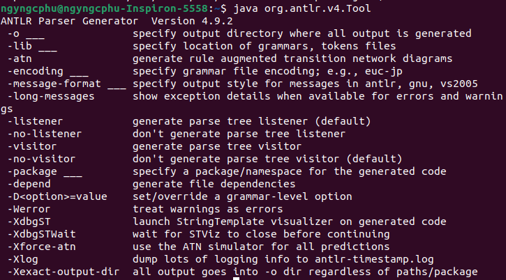
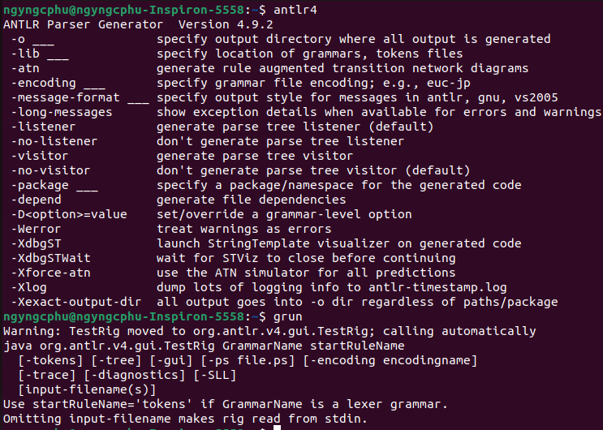
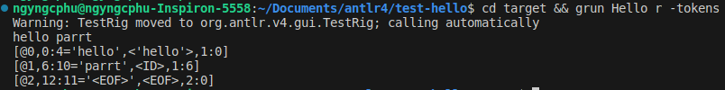

# ANTLR4 Cook Book

> My note for book The Definitive ANTLR 4 Reference - Terence Parr. I use antlr4 version 4.9.2 and antlr4-python3-runtime version 4.9.2.

## I. Installing ANTLR (Ubuntu 22.04)

### 1. Prerequisites
- `javac` >= v11.0.21
- `antlr` = v4.9.2
  - Dowload [antlr-4.9.2-complete.jar](https://www.antlr.org/download/antlr-4.9.2-complete.jar).
  - Move into `/usr/local/lib`.
### 2. Set up environment variables
- **CLASSPATH**: With CLASSPATH set, Java can find both the ANTLR tool and the runtime library.
- **ANTLR_JAR**: Store jar file.

Add two variables into file `~/.profile` (Please log out and log back in to your computer to activate environment variables):
```
export ANTLR_JAR=/usr/local/lib/antlr-4.9.2-complete.jar
export CLASSPATH=".:/usr/local/lib/antlr-4.9.2-complete.jar:$CLASSPATH"
```
Check to see that ANTLR is installed correctly now by running the ANTLR tool without arguments:  


### 3. Set up aliases
- **antlr4**: alternative to running java commands.
- **grun**: `TestRig` (testing tool) display lots of information about how a recognizer matches input from a file or standard input.

Add two aliases into file `~/.bashrc` (Please log out and log back in to your computer to activate aliases):
```
alias antlr4='java -jar /usr/local/lib/antlr-4.9.2-complete.jar -o target'
alias grun='java org.antlr.v4.runtime.misc.TestRig'
```
Check to see:  


### 4. Execute ANTLR and Testing Recognizers
> This is code from the book with Lexer and Parser generated from the antlr4 java runtime, it is for testing purposes only. All other exercises will be coded in python, using antlr4-python3-runtime.

Simple grammar that recognizes phrases in `test-hello/Hello.g4`:
```antlr4
grammar Hello;
r: 'hello' ID;
ID: [a-z]+;
WS: [ \t\r\n]+ -> skip;
```
- Generate parser and lexer:
    ```
    antlr4 Hello.g4
    ```
- Compile ANTLR-generated code:
    ```
    javac target/*.java
    ```
- Print the tokens created during recognition (type Ctrl-D to terminate reading from standard input):
    ```
    cd target && grun Hello r -tokens
    ```
    

## II. A Starter ANTLR Project

### 1. Prerequisites
- `python3` >= v3.10.12
- Run this command to install all dependencies:
    ```
    pip3 install -r requirement.txt
    ```

### 2. Testing tool
A tool like `grun` but written in Python. I put it in `bin/pygrun`.

### 3. Set up aliases
- **antlr4py3**: Run ANTLR tool with Python3 target.
- **pygrun**: Path to testing tool.

Add aliases into file `~/.bashrc` (Please log out and log back in to your computer to activate aliases):
```
alias antlr4py3='java org.antlr.v4.Tool -Dlanguage=Python3 -o target'
alias installdir='dirname "$(pwd)"'
alias pygrun='python3 "$(installdir)"/bin/pygrun'
```

#### Once fully installed, go [here](./01-array/) to view the exercise.